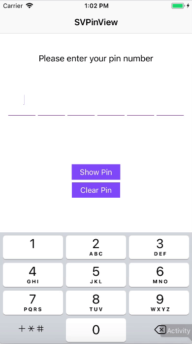
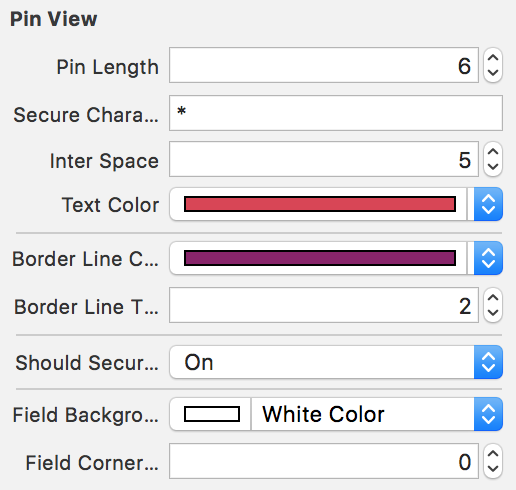

# SVPinView
SVPinView is a light-weight customisable library used for accepting pin numbers or one-time passwords.

<p align="left">
<a href="https://developer.apple.com/swift"></a>
<a href="https://cocoapods.org/pods/ScrollableDatepicker"></a>

<a href="https://raw.githubusercontent.com/maxsokolov/tablekit/master/LICENSE"></a>
</p>



## Getting Started

An [example project](https://github.com/xornorik/SVPinView/blob/master/SVPinView/Example) is included for demonstrating the functionality of SVPinView.


## Installation

### CocoaPods

Add the following line to your Podfile:

```ruby
pod 'SVPinView', '~> 1.0'
```

Then run the following in the same directory as your Podfile:
```ruby
pod install
```

### Manual

Clone the repo and drag files from `SVPinView/Source` folder into your Xcode project.

## Usage

### Storyboard


### Code
```swift
pinView.pinLength = 5
pinView.secureCharacter = "\u{25CF}"
pinView.interSpace = 5
pinView.textColor = UIColor.black
pinView.shouldSecureText = true
pinView.style = .box

pinView.borderLineColor = UIColor.black
pinView.activeBorderLineColor = UIColor.lightGray
pinView.borderLineThickness = 1
pinView.activeBorderLineThickness = 3

pinView.font = UIFont.systemFont(ofSize: 15)
pinView.keyboardType = .phonePad
pinView.pinIinputAccessoryView = UIView()
pinView.placeholder = "******"
pinView.becomeFirstResponderAtIndex = 0
```
The `becomeFirstResponderAtIndex` property sets the pinField at the specified index as the first responder.
The `isContentTypeOneTimeCode` property sets the contentType of the first pinField to `.oneTimeCode` to leverage the iOS 12 feature where the passcode is directly fetched from the messages. 

#### Styles
```swift
enum SVPinViewStyle : Int {
case none = 0
case underline
case box
}
```
There are two inbuilt styes; `underline` & `box`. However, the *fieldBackgroundColor* & *fieldCornerRadius* properties along with *activeFieldBackgroundColor* & *activeCornerRadius* properties can be used to create custom styles.
```swift
pinView.style = .none
pinView.fieldBackgroundColor = UIColor.white
pinView.fieldCornerRadius = 0
```
### Methods

- **getPin()**: Returns the entered pin as a String. If the method is called when the pin entry is incomplete, it returns an *empty* String for validation.
- **pastePin()**: Takes a String as an argument and enters it into the pinView. Useful for showing default values or for pasting from clipboard. Long-press on the pin field will also allow pasting from the clipboard.
- **clearPin()**: Clears the entered pin.

### Callbacks

- **didFinishCallback**: Gets executed after the entire pin has been entered. This is useful when a network call has to be made or for navigating to a different ViewController after the pin has been entered.
- **didChangeCallback**: Gets executed when any of the pinFields have been changed. This gives additional control to the parent VC - Eg: if a submit button has to be enabled/disabled based on the pin validation. 
```swift
pinView.didFinishCallback = { pin in
print("The pin entered is \(pin)")
}
```
```swift
pinView.didChangeCallback = { pin in
submitButton.isEnabled = isValid(pin)
}
```

## Requirements

- iOS 9.0 +
- Xcode 8.0 +

## License

SVPinView is available under the MIT license. See LICENSE for details.
